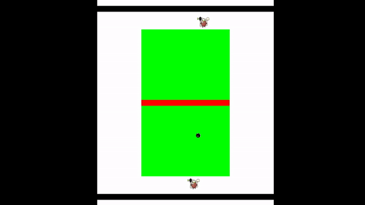
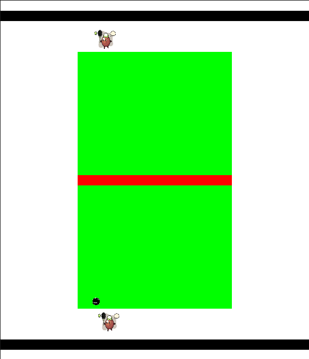
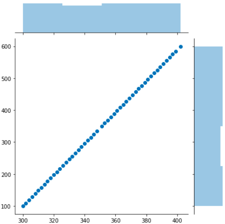
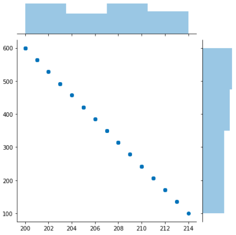

# A reinforcement learning based tennis game - Discrete mathematics approach

### An RL environment built using pygame





### Pytennis Environmental Description

1. There exist 2 agents (2 players) with a ball.

2. There exist a tennis lawn of dimension (x, y) - (300, 500)

3. The ball was designed to move on a straight line, such that agent A decides a target point between x1 (0) and x2 (300) of side B (Agent B side), therefore it displays the ball 50 different times with respect to an FPS of 20. This therefore, makes the ball move in a straight line from source to destination. This applies respectively to agent B.

4. Movement of AgentA and AgentB are both bound between (x1= 100, to x2 = 600).

5. Movement of the ball is bounded along the y-axis (y1 = 100 to y2 = 600).

6. Movement of the ball is bounded along the x-axis (x1 = 100, to x2 = 600).


 [Watch on youtube here](https://youtu.be/iUYxZ2tYKHw)


## Playing the Game





###  Discrete mathematics approach

This uses the y = mx + c approach to forecast new ball locations

Below shows, Agent A, predicting coordinate (x1, y1) - (300, 100) from its present point (x2, y2)-(450, 600)





Below shows, Agent B, predicting coordinate (x1, y1) - (200, 600) from its present point (x2, y2) - (214, 100)





### To run program follow the process below:


To clone the work and run the game.ipynb via jupyter notebook having executed the following commands below


``` 
git clone https://github.com/elishatofunmi/pytennis.git

cd pytennis

pip install -r requirement.txt

# go ahead to run game.ipynb cell by cell via jupyter notebook/ jupyterlab

```


To clone the work and run the main.py file using the following commands below

``` 
git clone https://github.com/elishatofunmi/pytennis.git

cd pytennis

pip install -r requirement.txt

python main.py

```
